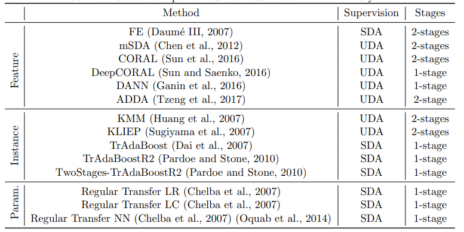

# Domain-Adaptation-for-Predicting-Next-Actions
Deep domain adaptation for predicting the next pitch decision for new MLB pitchers without retraining

## Overview

## References

[1] de Mathelin, Antoine, François Deheeger, Guillaume Richard, Mathilde Mougeot, and Nicolas Vayatis. "Adapt: Awesome domain adaptation python toolbox." arXiv preprint arXiv:2107.03049 (2021).

[2] Peng, Xingchao, Ben Usman, Kuniaki Saito, Neela Kaushik, Judy Hoffman, and Kate Saenko. "Syn2real: A new benchmark forsynthetic-to-real visual domain adaptation." arXiv preprint arXiv:1806.09755 (2018).

[3] Ott, Felix, David Rügamer, Lucas Heublein, Bernd Bischl, and Christopher Mutschler. "Domain Adaptation for Time-Series Classification to Mitigate Covariate Shift." arXiv preprint arXiv:2204.03342 (2022).